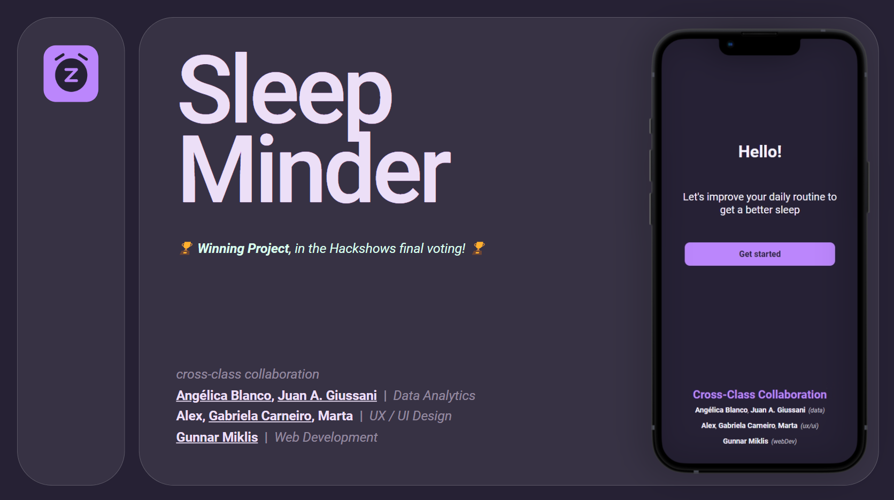

# App SleepMinder

🏆 Winning Project, in the Hackshows final voting! 🏆 

Check out the [project presentation pitch](https://pitch.com/public/2dc2b9ee-6701-4c6b-a012-ae53ddba8a77), to get some insights!

### 🪧 **About**
MERN Full-Stack SPA Web Application

Final Project – Module 3 – Ironhack WebDev Bootcamp 2023 _(developed in just 9 days)_

Cross-Class Collaboration _( Data Analytics → UX/UI Design → Web Development )_

---

💻 Frontend: React, Axios

⚙️ Backend: Express

🗃️ Database: MongoDB

🔐 Authorization: JSON Web Token
